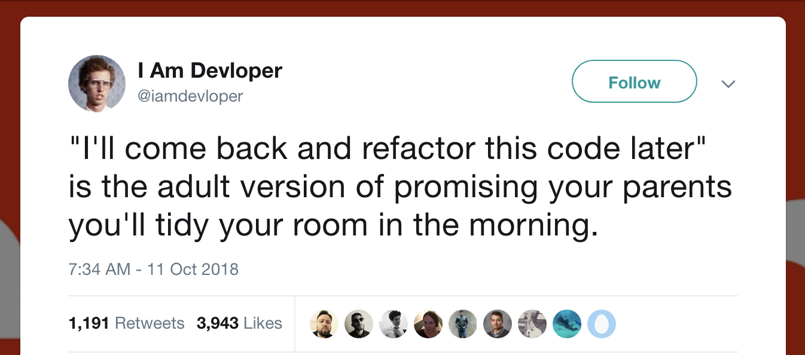
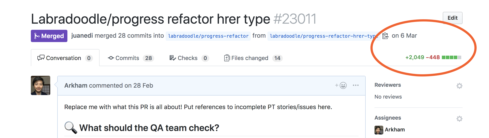
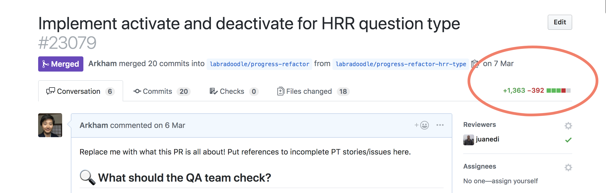
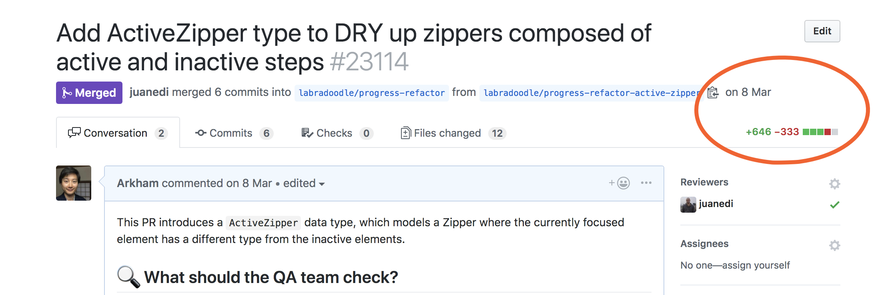

theme: Simple
footer: @arkh4m
build-lists: true

[.background-color: #60B5CC]
[.header: #FFFFFF, text-scale(1.7), alignment(left)]
[.footer-style: #FFFFFF, text-scale(1.5)]
[.footer: @arkh4m . jsday]


# Fearless<br>Refactoring<br>in __ELM__

---

# Hello! 🙇🏻‍♂️

- My name is Ju
- I'm from 🇨🇳🇮🇹🇬🇧
- I work for __no__red__ink__
- I'm __@arkh4m__ on twitter

---

# Before we start 🤚

^ Any Elm beginners? Don't be shy :)

---

# What this talk is going to be about

---

# 😨 __FEAR__ 😰

---

# Let's start from a painting


^ This is from Francisco Goya, 1799

---

# __ENHANCE__


---

## The sleep of reason produces monsters...

---

# Just like refactoring in Javascript.

---

# You doze off for a few seconds...

---

# 💥 __BAM__ 💥

---


---


--

## This is __very__ scary when we refactor our code

---

# Refactoring shouldn't change<br>the behaviour of our code

---

# But it __DOES__

---

# So we don't do it! 😈

---



---

# Who has test suites? 🤚

---

# Who trusts their test suites? 🤚

---

# How long does it take to run your test suite? 1-10 mins 🤚

---

# How long does it take to run your test suite? 10-20 mins 🤚

---

# How long does it take to run your test suite? 20+ mins 🤚

---

# Who trusts their test suites to catch<br>all regressions after a refactor<br>that touches 20 files? 🤚

---

# 😨 __FEAR__ 😰

---

# With fear comes self-doubt

---


---

# We always talk about<br>__Impostor Syndrome__

---

[.footer: Rest In Peace, Joe. 1950-2019]


---

# Why do we always<br>blame ourselves?

^ Could it be that the tools we are using are not good enough?

---


---


# [Speed Without Wizardry](http://fitzgeraldnick.com/2018/02/26/speed-without-wizardry.html)

---

# Safety Without Wizardy

---


# What if there was a solution? 💡

---


---

# What is Elm

- A __strongly typed__ functional programming language
- Designed to build frontend webapps
- Compiles to JavaScript

---

# Strongly typed you say?

> Whenever an object is passed from a calling function<br>to a called function, its type must be compatible<br>with the type declared in the called function.
-- [Liskov & Zilles, 1974](http://citeseerx.ist.psu.edu/viewdoc/download?doi=10.1.1.136.3043&rep=rep1&type=pdf)

---

# __DEMO TIME__

---

# Function Signatures ✍️

```elm
add : Int -> Int -> Int
add x y = x + y
```

---

# Currying 🍛

```elm
add : Int -> Int -> Int
add x y = x + y

add1 : Int -> Int
add1 = add 1

result : Int
result = add1 4 -- 5
```

---

# Actually in Elm a function can <br> only take a __single__ argument

---


---

# Function Signatures, Pt II


[.code-highlight: 1-2]
[.code-highlight: 1-5]

```elm
add : Int -> (Int -> Int)
add x y = x + y

add1 : Int -> Int
add1 = add 1 -- this is now waiting for a y
```

---

# Function Signatures, Pt III

```js
const array = [1, 4, 9, 16];
array.map(x => x * 2); // [2, 8, 18, 32]
```

---

# Function Signatures, Pt III


[.code-highlight: 1-2]
[.code-highlight: 1-4]
[.code-highlight: 1-8]

```elm
array = [1, 4, 9, 16]
List.map (\x -> x * 2) array -- [2, 8, 18, 32]

-- List.map : (a -> b) -> List a -> List b

doubleEverything: List Int -> List Int
doubleEverything list =
    List.map (\x -> x * 2) list
```

---

# Function Signatures, Pt IV

[.code-highlight: 1-4]
[.code-highlight: 1-7]
[.code-highlight: 1-10]

```elm
-- List.map : (a -> b) -> List a -> List b

specializedMap : (Int -> String) -> List Int -> List String
specializedMap fun list = List.map fun list

specializedMap (\x -> String.fromInt x) [1, 2, 3]
// ["1","2","3"]

specializedMap (\x -> x * 2) [1, 2, 3]
// ???
```

---

```
Type Mismatch
Line 55, Column 21
The 1st argument to `specializedMap` is not what I expect:

55|     specializedMap (\x -> x * 2) [1,2,3]
                        ^^^^^^^^^^^
This argument is an anonymous function of type:

    Int -> Int

But `specializedMap` needs the 1st argument to be:

    Int -> String

Hint: Want to convert an Int into a String? Use the String.fromInt function!
```

---

# __ELI5__<br>Function Signatures


---

# But.. what about arguments<br>that can be `null`?


---

# Well..

---


---

# Let's say we want to grab<br>the first element of a list

---

```elm
List.head : List a -> Maybe a
```

---

```
> List.head []
Nothing

> List.head [1, 2, 3]
Just 1
```

---

```elm
type Maybe a
    = Just a
    | Nothing
```

---

# How do we use it?

---

[.code-highlight: 1]
[.code-highlight: 1-2]
[.code-highlight: 1-3]
[.code-highlight: 1-6]
[.code-highlight: 1-8]

```elm
headToString : List Int -> String
headToString list =
    case List.head list of 
        Just value ->
            String.fromInt value

        Nothing ->
            "List was empty, I'm sorry"
```

---

```js
array[0].toString()
```

---


---

# So instead of `null` we have `Maybes`

---

> δῶς μοι πᾶ στῶ καὶ<br>τὰν γᾶν κινάσω

---

> δῶς μοι πᾶ στῶ καὶ<br>τὰν γᾶν κινάσω
-- On the Equilibrium of Planes

---

> δῶς μοι πᾶ στῶ καὶ<br>τὰν γᾶν κινάσω
-- Archimedes, On the Equilibrium of Planes

---


> Give me a place to stand on, and I will move the earth
-- Archimedes, _On the Equilibrium of Planes_

---


> Give me types to write with, and I will refactor with confidence
-- Anonymous

---

# __Custom Types__

---

# Imagine we have two kinds of users, students and teachers

---

# We could have a field called `kind` that describes that

---

```js
function userTitle(userKind) {
  switch(userKind) {
    case "student":
      return "Student";

    case "teacher":
      return "Teacher";
  }
}
```

---

# What happens if you make a typo and write `studemt`?

---

# What happens if you add another kind of User?

---


---

# In Elm you can make<br>your own datatypes

---

[.code-highlight: 1-3]
[.code-highlight: 1-12]

```elm
type UserKind
    = Student
    | Teacher

userTitle : UserKind -> String
userTitle userKind =
    case userKind of
      Student ->
        "Student"

      Teacher ->
        "Teacher"
```

---

# No more typos, like __ever__

---

# __DEMO TIME__
## [Hello World](https://ellie-app.com/5tNDCRphqnYa1)

---

# __DEMO TIME__
## [Mondrian](https://ellie-app.com/5tNBy2c2mTza1)

---

# __DEMO TIME__
## [Escher](https://github.com/einarwh/escher-workshop)

---

# But.. can you use it in production?


---


---

# Elm in production

- __4 years__ in production
- __100 million__ requests per day
- __250'000__ LOC Elm code
- __100'000__ LOC Elm tests

---

# And... is it safe?


---


---

# __ANOTHER DEMO__

---



---



---


---



---

# [How to use Elm at work](https://elm-lang.org/blog/how-to-use-elm-at-work)

---

# 🙏 THANK YOU 🙏

🐥 __@arkh4m__

🔗 __github.com/Arkham/jsdayit

🌍 Want to write Elm remotely?

🤖 __noredink.com/jobs__
