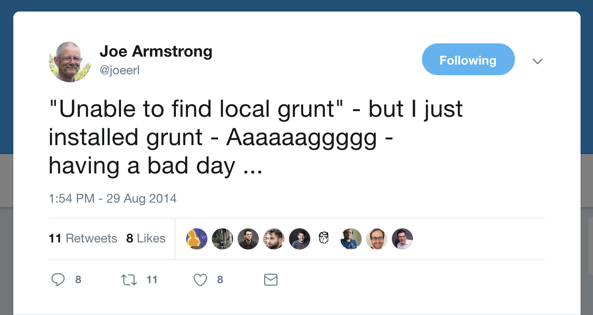
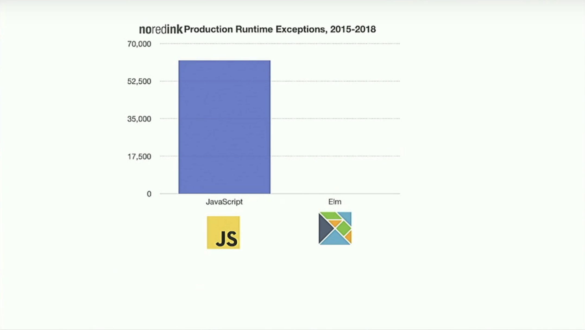

theme: Simple
footer: @arkh4m
build-lists: true

[.background-color: #60B5CC]
[.header: #FFFFFF, text-scale(1.7), alignment(left)]
[.footer-style: #FFFFFF, text-scale(1.5)]


# Fearless<br>Refactoring<br>in __ELM__

---

# Hello! 🙇🏻‍♂️

- My name is Ju
- I'm from 🇨🇳🇮🇹🇬🇧
- I work for __no__red__ink__
- I'm __@arkh4m__ on twitter

---

# Before we start 🤚

^ Any Elm beginners? Don't be shy :)

---

# What this talk is going to be about

---

# 😨 __FEAR__ 😰

---

# Let's start from a painting


^ This is from Francisco Goya, 1799

---

# ENHANCE!


---

## The sleep of reason produces monsters...

---

# Just like refactoring in Javascript.

---

# You doze off for a few seconds...

---

# 💥 BAM 💥

---


---


--

## This is __very__ scary when we refactor our code

---

# Refactoring shouldn't change the behaviour of our code

---

# But it __DOES__

---

# So we don't do it! 😈

---

# Who has test suites? 🤚

---

# Who trusts their test suites? 🤚

---

# Who trusts their test suites to catch all regressions after a refactor that touches 20 files? 🤚

---

# 😨 __FEAR__ 😰

---

# With fear comes self-doubt

---


---

# We always talk about<br>Impostor Syndrome

---

[.footer: Rest In Peace Joe 1950-2019]



---

# Why do we always blame ourselves?

^ Could it be that the tools we are using are not good enough?

---


---

# What if there was a solution? 💡

---


---

# What is it

- A __strongly typed__ functional programming language
- Designed to build frontend webapps
- Compiles to JavaScript

---

# Strongly typed you say?

> Whenever an object is passed from a calling function<br>to a called function, its type must be compatible<br>with the type declared in the called function.
-- [Liskov & Zilles, 1974](http://citeseerx.ist.psu.edu/viewdoc/download?doi=10.1.1.136.3043&rep=rep1&type=pdf)

---

# DEMO TIME!

---

# Function Signatures

```elm
add : Int -> Int -> Int
add x y = x + y
```

---

# Currying 🍛

```elm
add1 : Int -> Int
add1 = add 1

add1to4 : Int
add1to4 = add1 4 -- 5
```

---

# Actually in Elm a function can <br> only take a **single** argument.

---


---

# Function Signatures, Pt II

```elm
add : Int -> (Int -> Int)
add x y = x + y

add1 : Int -> Int
add1 x = x + 1
```

---

# Function Signatures, Pt III

```js
const array = [1, 4, 9, 16];
array.map(x => x * 2); // [2, 8, 18, 32]
```

---

# Function Signatures, Pt III

```elm
array = [1, 4, 9, 16]
List.map (\x -> x * 2) array -- [2, 8, 18, 32]
```

---

# Function Signatures, Pt III

```elm
array = [1, 4, 9, 16]
List.map (\x -> x * 2) array -- [2, 8, 18, 32]

-- map : (a -> b) -> List a -> List b
```

---

# Function Signatures, Pt III

```elm
array = [1, 4, 9, 16]
List.map (\x -> x * 2) array -- [2, 8, 18, 32]

-- map : (a -> b) -> List a -> List b

doubleEverything: List Int -> List Int
doubleEverything list =
    List.map (\x -> x * 2) list
```

---

# Function Signatures, Pt III

```elm
array = [1, 4, 9, 16]
List.map (\x -> x * 2) array -- [2, 8, 18, 32]

-- map : (a -> b) -> List a -> List b

doubleEverything: List Int -> List Int
doubleEverything =
    List.map (\x -> x * 2)
```

---

# Function Signatures, Pt IV

```elm
-- map : (a -> b) -> List a -> List b

specializedMap : (Int -> String) -> List Int -> List String
specializedMap fun list = List.map fun list
```

---

# Function Signatures, Pt IV

```elm
-- map : (a -> b) -> List a -> List b

specializedMap : (Int -> String) -> List Int -> List String
specializedMap fun list = List.map fun list

specializedMap (\x -> String.fromInt x) [1, 2, 3]
// ["1","2","3"]
```

---

# Function Signatures, Pt IV

```elm
-- map : (a -> b) -> List a -> List b

specializedMap : (Int -> String) -> List Int -> List String
specializedMap fun list = List.map fun list

specializedMap (\x -> x * 2) [1, 2, 3]
```

---

```
Type Mismatch
Line 55, Column 21
The 1st argument to `specializedMap` is not what I expect:

55|     specializedMap (\x -> x * 2) [1,2,3]
                        ^^^^^^^^^^^
This argument is an anonymous function of type:

    Int -> Int

But `specializedMap` needs the 1st argument to be:

    Int -> String

Hint: Want to convert an Int into a String? Use the String.fromInt function!
```

---

# __ELI5__<br>Function Signatures


---

# DEMO TIME!
## [Mondrian](https://ellie-app.com/5scKgds7bxFa1)

---

# But.. can you use it in production?


---


---

# Elm in production

- **100 million** requests per day
- **250'000** LOC Elm code
- **100'000** LOC Elm tests

---



---

There is no null

Amazing compiler

Amazing errors

Big changes very confident


How to use Elm at work

---

# 🙏 THANK YOU 🙏

🐥 **@arkh4m**

🌍 Want to write Elm remotely?

🤖 **noredink.com/jobs**
